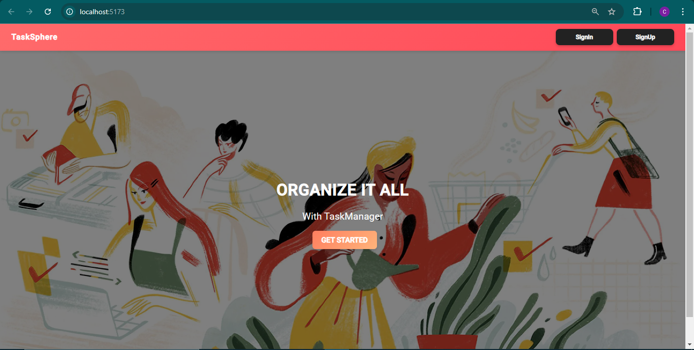
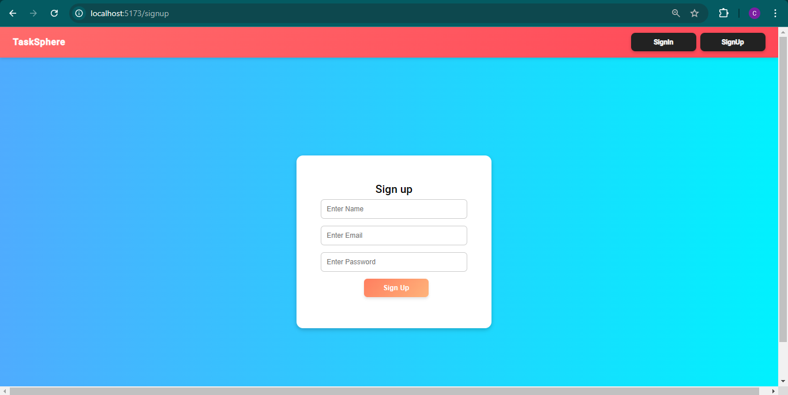
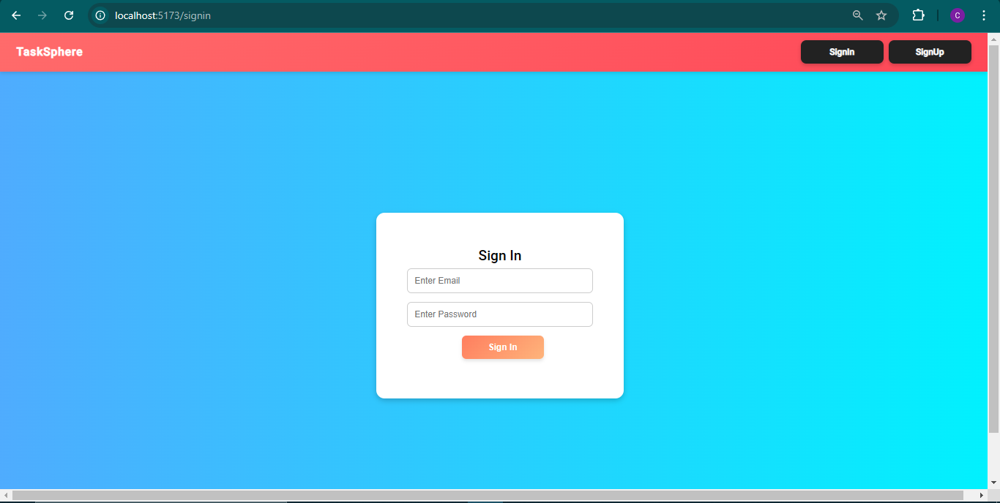
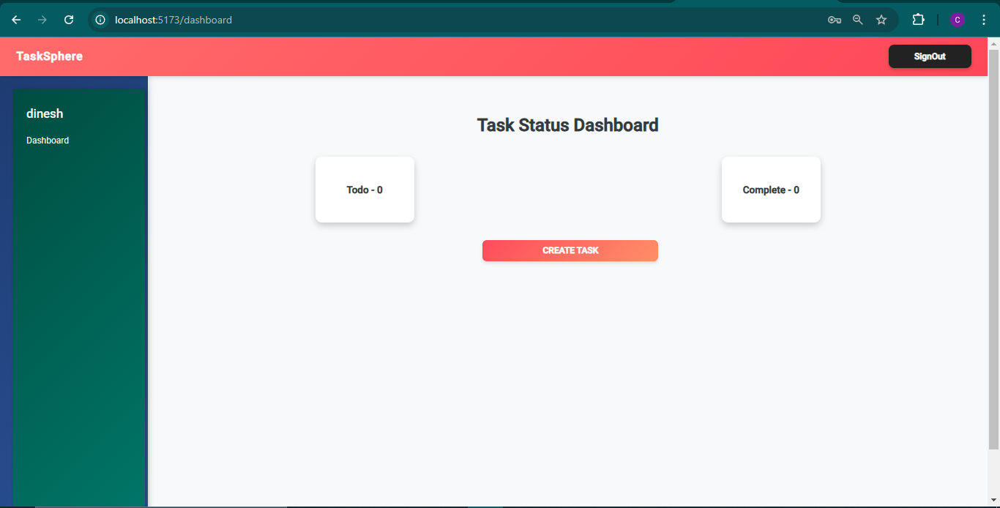
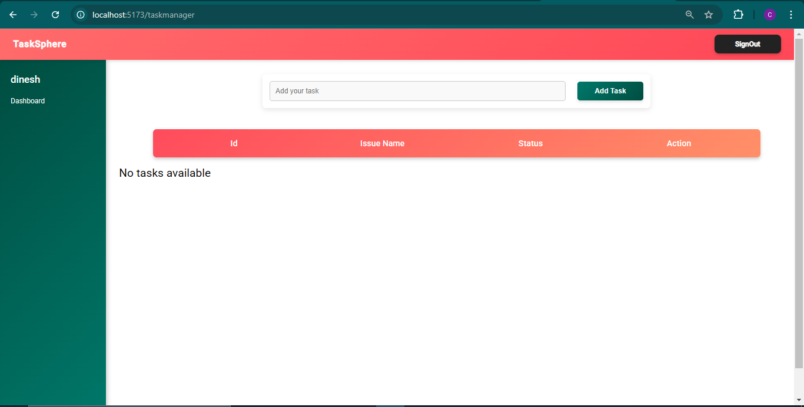

📌 TaskSPHERE App
A simple MERN stack task management application where users can sign up, log in, and manage tasks efficiently.

🚀 Features
✅ User Authentication (Signup & Login)
✅ Create, Edit, and Delete Tasks
✅ Task Status Management
✅ User Dashboard

📸 Screenshots

### **🔹 Home Page**

### **🔹 Signup Page**

### **🔹 Login Page**

### **🔹 Welcome Dashboard**

### **🔹 Task Management**

👨‍💻 Technologies Used
Frontend: React.js, Redux, Tailwind CSS
Backend: Node.js, Express.js
Database: MongoDB
